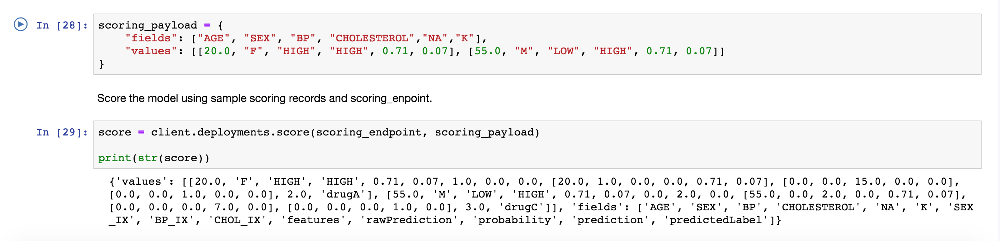
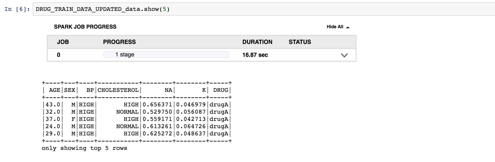

#Work In Progress. Please re-visit soon for the completed code pattern.

> **DISCLAIMER**: This notebook is used for demonstrative and illustrative purposes only and does not constitute an offering that has gone through regulatory review. It is not intended to serve as a medical application. There is no representation as to the accuracy of the output of this application and it is presented without warranty.

# Prediction Using Watson Machine Learning

In this Code Pattern, we will use anonymous patient data to predict the best drug to treat heart disease. This notebook introduces commands for getting data, model persistance to Watson Machine Learning repository, model deployment, and scoring.

When the reader has completed this Code Pattern, they will understand how to:

* Prepare data, create an Apache Spark machine learning pipeline, and train a model.
* Publish a sample model in the Watson Machine Learning (WML) repository.
* Deploy a model for online scoring.
* Score the model using sample scoring records and the scoring endpoint.

## Flow
TBD

## Prerequisites

* An [IBM Cloud Account](https://console.bluemix.net).

* An account on [IBM Watson Studio](https://dataplatform.ibm.com).

# Steps

1. [Clone the repository](#1-clone-the-repository)
1. [Create Watson services in IBM Cloud](#2-create-watson-services-in-ibm-cloud)
1. [Save the credentials for your Watson Machine Learning Service](#3-save-the-credentials-for-your-watson-machine-learning-service)
1. [Create the DB2 Warehouse on Cloud Service and load data](#4-create-the-db2-warehouse-on-cloud-service-and-load-data)
1. [Create a notebook in IBM Watson Studio](#5-create-a-notebook-in-ibm-watson-studio)
1. [Run the notebook in IBM Watson Studio](#6-run-the-notebook-in-ibm-watson-studio)

### 1. Clone the repository

```
$ git clone https://github.com/IBM/prediction-using-watson-machine-learning
$ cd prediction-using-watson-machine-learning
```

### 2. Create Watson services in IBM Cloud

* Create a new project by clicking `+ New project` and choosing `Data Science`:


> Note: Services created must be in the same region, and space, as your Watson Studio service.
> Note: If this is your first project in Watson Studio, an object storage instance will be created.

* Under the `Settings` tab, scroll down to `Associated services`, click `+ Add service` and choose `Watson`:


* Search for `Machine Learning`, Verify this service is being created in the same space as the app in Step 1, and click `Create`.

  

* Alternately, you can choose an existing Machine Learning instance and click on `Select`.

  

* The Watson Machine Learning service is now listed as one of your `Associated Services`.

* Click on the `Settings` tab for the project, scroll down to `Associated services` and click `+ Add service` ->  `Spark`.

* Either choose an `Existing` Spark service, or create a `New` one.

  

  

### 3. Save the credentials for your Watson Machine Learning Service

* In a different browser tab go to [http://console.bluemix.net](http://console.bluemix.net) and log in to the Dashboard.

* Click on your Watson Machine Learning instance under `Services`, click on `Service credentials` and then on `View credentials` to see the credentials.

  

* Save the username, password and instance_id to a text file on your machine. You’ll need this information later in your Jupyter notebook.

### 4. Create the DB2 Warehouse on Cloud Service and load data

* Create a [Db2 Warehouse on Cloud Service](https://console.bluemix.net/catalog/services/db2-warehouse-on-cloud/) instance (an entry plan is offered).

* Create the `DRUG_TRAIN_DATA_UPDATED` table in Db2 Warehouse on Cloud. You will use the [drug_train_data_updated.csv](data/drug_train_data_updated.csv) file from this git repository.

* Click the `Open` icon to open the console.

* Select the `Load Data` and `Desktop` load type.

* Drag and drop the `data/drug_train_data_updated.csv` file and press `Next`.

* Select `Schema` to import data and click `New Table`.

* Write the name `DRUGTRAINDATA` for the new table than click `Next` to finish data import.

* Use `;` as field separator.

* Click `Next` to create a table with the uploaded data.

* Get the authentication information for DB2, which can be found under the `Service Credentials` tab of the Db2 Warehouse on Cloud service instance created in IBM Cloud. Click `New credential` to create credentials if you do not have any.

### 5. Create a notebook in IBM Watson Studio

* In [Watson Studio](https://dataplatform.ibm.com) using the project you've created, click on `+ Add to project` -> `Notebook` OR in the `Assets` tab under `Notebooks` choose `+ New notebook` to create a notebook.
* Select the `From URL` tab.
* Enter a name for the notebook.
* Optionally, enter a description for the notebook.
* Under `Notebook URL` provide the following url: https://raw.githubusercontent.com/IBM/prediction-using-watson-machine-learning/master/notebooks/MLpredictor.ipynb
* Select the Spark runtime with Python 3.5 .
* Click the `Create` button.

  

### 6. Run the notebook in IBM Watson Studio

* Enter your DB2 Warehouse credentials in the cell after `2.1 Load the training data from Db2 Warehouse on Cloud`.

* Enter your Watson Machine Learning credentials in the cell after `Action: Enter your Watson Machine Learning service instance credentials here.` .

* Move your cursor to each code cell and run the code in it. Read the comments for each cell to understand what the code is doing. **Important** when the code in a cell is still running, the label to the left changes to **In [\*]**:.
  Do **not** continue to the next cell until the code is finished running.

# Sample Output





# License
[Apache 2.0](LICENSE)
